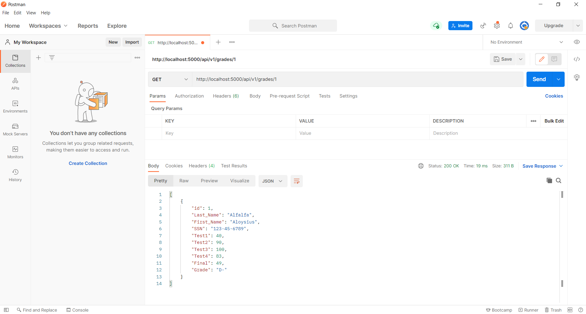

# Project Description
This project is a homework assignment to teach how to get Pycharm setup with Docker, Flask, MySQL, and Postman.

## Postman Screenshot

## Output Screenshots
* [Click here to open file!](IS-601_hw-05.pdf)

## Postman Output Screenshots
* [Click here to open file!](Jenil_Oza_Project-03_GradesData_Postman.pdf)
